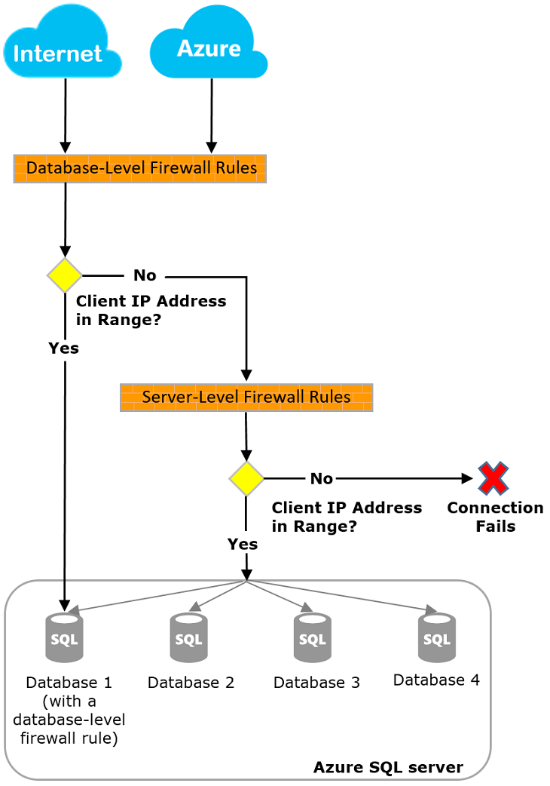

# mmdt-database

**Instructions for setting up a home library database in Microsoft Azure Cloud and accessing it using SQL and Python.**

---


## Prerequisites:
- A Microsoft Azure account. If you don't have one, you can create a free account [here](https://azure.microsoft.com/free/).
- Basic knowledge of SQL and Python.
- Azure Data Studio (optional but recommended) to manage your database graphically.

---

## 1. Set Up Your SQL Database in Azure

### Step 1: Create an Azure SQL Database
1. Sign in to the [Azure Portal](https://portal.azure.com/).
2. In the left-hand menu, click on **Create a resource**.
3. Search for **SQL Database** and select it.
4. Fill in the required information:
   - **Subscription**: Choose your subscription.
   - **Resource Group**: Create a new resource group or select an existing one.
   - **Database Name**: Name your database, e.g., `LibraryDB`.
   - **Server**: You can either create a new server or use an existing one.
   - **Compute + Storage**: Choose the performance and storage level that fits your needs.
   - **Authentication method**: SQL authentication or Azure Active Directory.
5. Click **Review + Create**, then click **Create**.

### Step 2: Configure Firewall Rules
1. After your SQL database is deployed, go to the **SQL Server** resource from the Azure portal.
2. On the left-hand panel, under **Security**, click on **Networking**.
3. Add your local IP address or the IP range of your college network to the **Firewall rules** section to allow access to your database.
   - Example firewall rule:
     - Rule name: `LibraryAccess`
     - Start IP: `10.3.0.1`
     - End IP: `10.3.0.254`
4. Click **Save**.

---

## 2. Access the Database with SQL

### Option 1: Using Azure Data Studio
1. **Install Azure Data Studio** from [here](https://learn.microsoft.com/en-us/sql/azure-data-studio/download-azure-data-studio).
2. Open Azure Data Studio and click on **New Connection**.
3. Enter your connection details:
   - **Server name**: `<Your Server Name>.database.windows.net`.
   - **Authentication**: SQL Server Authentication or Azure AD Authentication.
   - **Username/Password**: The credentials you created earlier.
4. Click **Connect**.
5. After connecting, open a new query editor and start running SQL queries to manage your database. For example:
   ```sql
   CREATE TABLE Books (
     BookID INT PRIMARY KEY,
     Title NVARCHAR(100),
     Author NVARCHAR(100),
     PublishedYear INT
   );
